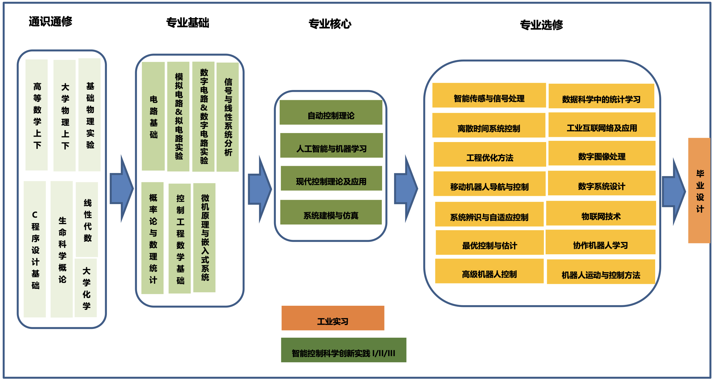

# Courses

## Roadmap
class of 2022 

## Compulsory Courses
### Math & Physics
- Calculus and Physics
- [MA113 Linear Algebra](courses/MA113.md)
- [MA212 Probability and Statistics](courses/MA212.md)

### EE
- [EE201-17 Analog Circuits](courses/EE201-17.md)
- [EE201-17L Analog Circuits Laboratory](courses/EE201-17L.md)
- [EE202-17 Digital Circuits](courses/EE202-17.md)
- [EE202-17L Digital Circuits Laboratory](courses/EE202-17L.md)
- [EE205 Signals and Systems](courses/EE205.md)
- [EE351 Microprocessors and Microsystems](courses/EE351.md)
- [EE368 Robotic Motion and Control](courses/EE368.md)

### SDIM
- [SDM252 Introduction to C/C++ Programming](courses/SDM252.md)
- [SDM263 Feedback Control Theory](courses/SDM263.md)
- [SDM271 System Modeling and Simulation](courses/SDM271.md)
- [SDM274 Artificial Intelligence and Machine Learning](courses/SDM274.md)
- [SDM364 Multi-variable Control and Applications](courses/SDM364.md)
- [SDM405 Graduation Thesis](courses/SDM405.md)

### Before class of 2022
- [EE317 Advanced Experimental Studies I](courses/EE317.md)
- [ME333 Mechatronic Systems](courses/ME333.md)

## Optional Courses
### CS
- [CS201 Discrete Mathematics](courses/CS201.md)
- [CS203B Data Structures and Algorithms B](courses/CS203B.md)
- [CS305B Computer Networks B](courses/CS305B.md)

### EE
- [EE326 Digital Image Processing](courses/EE326.md)
- [EE332 Digital System Design](courses/EE332.md)
- [EE340 Statistical Learning for Data Science](courses/EE340.md)
- [EE342 Sensors and Applications](courses/EE342.md)
- [EE346 Mobile Robot Navigation and Control](courses/EE346.md)

### SDIM
- [SDM273 Intelligent Sensors and Signal Processing](courses/SDM273.md)
- [SDM357 Computer Networking and its Industrial Application](courses/SDM357.md)
- [SDM359 Advanced Machine Learning](courses/SDM359.md)
- [SDM366 Optimal Control and Estimation](courses/SDM366.md)
- [SDM368 Convex Optimization and its Application in Machine Learning](courses/SDM368.md)
- [SDM5006 System Identification and Adaptive Control](courses/SDM5006.md)
- [SDM5008 Advanced Robotics Control](courses/SDM5008.md)

### Others
- [COE491&492 Comprehensive Design I & II](courses/COE491%26492.md)