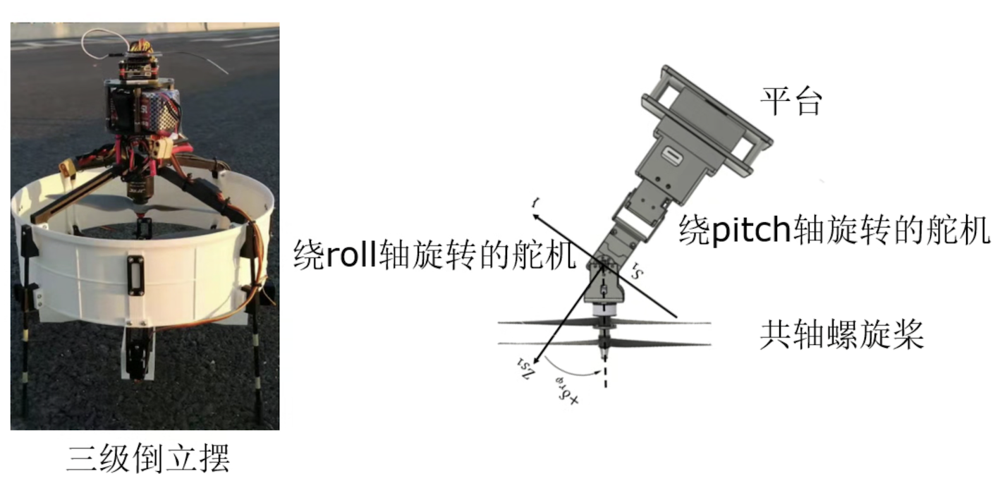

# SDM271 System Modeling and Simulation 
系统建模与仿真

> 这门课在南科自动化属于新课程，不同学年之间的课程内容、考核方式可能出现较大差异，请以实际情况为准

## Introduction
(基于 2023 年春季学期)

理论上自动化的终极课程。在这门课上，你将融会贯通高数、线代、大物（实际上说分析力学会更合理一点）、工程数学、古典控制（传递函数）与现代控制（状态空间），学习建模、拉格朗日法、系统辨识、各类仿真法、离散时间时间系统等知识。

当然由于这门课的开课时间是大二下，只有少数天赋异禀或课程进度极快的同学能够真正理解这门课的全部内容。更多的同学可能需要在之后的学习中才能领悟这门课程的美妙。

## Notes
- [squarezhong/Lecture Notes](https://squarezhong.notion.site/System-Modeling-and-Simulating-41428a85a1e6476d89a4029f5390ba7a?pvs=4) 

## Lab
> 2023 Spring

- 使用 MATLAB/Simulink 进行数学计算、仿真练习
- 使用 NCSLab 进行控制系统仿真及实物实验、撰写实验报告
- 倒立摆相关实验

## Projects
> 2023 Spring

以下两个 Project 均为 Bonus，二选一即可，上限为 10 分。

**Project 1**：飞行三阶倒立摆（建模+仿真）

1. 动力学方程建模（3分）
可用拉格朗日法，或者重心近似在平台形心处不动的牛顿法
注：模型输入为共轴螺旋染的两个转速，一个绕roll轴的舵机转角，一个绕pitch轴的舵机转角；输出为平台位置和姿态
2. MATLAB/Simulink数字仿真（3分）
注：尝试设计控制算法保证平台稳定在离地面的某一已知高度，即实现悬停
3. 虛拟样机仿真，奶ADMAS, Unreal Engine... （4分）
需对比上一点Simulink里面得到的仿真效果，并分析仿真效果不一样的可能原因

**Project 2**：飞行倒立摆（建模+实物实验）

如下图所示，完成四旋翼无人机飞行一阶倒立摆的建模与实物实验。

参考视频链接: [飞行倒立摆](https://www.bilibili.com/video/BV15s4y1g7eG) 

> 2024 Spring

2024 春季学期的 Project 难度相比前一年有了巨大的降低，应该可以帮助更多同学更好地理解这门课程。