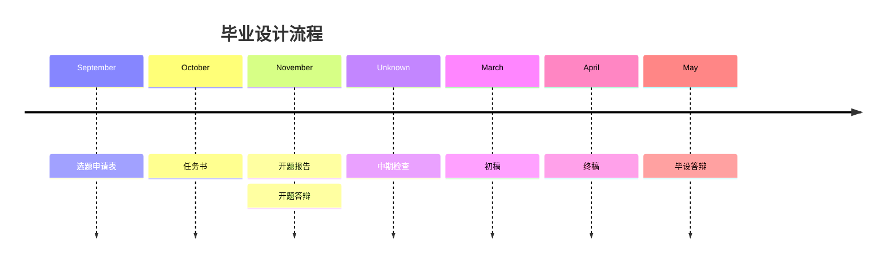

# SDM405 毕业论文（设计）

## 选题
届时系秘会放出各老师提供的选题列表，当然你也可以与老师沟通后确定其他的题目。

- p.s.1 如果你保研至外校，你可以将外校老师提供的课题作为毕设，但同时需要一位本系老师作为指导老师。
- p.s.2 你也可以选择工学院提供的“综合设计”作为毕设，详情请参考 [COE491&492 综合设计](/courses/COE491&492.md)。

## 流程
该流程仅供参考，请以系秘发布的具体时间为准。

## 毕设评价

毕设低于 80 分将无法保研。