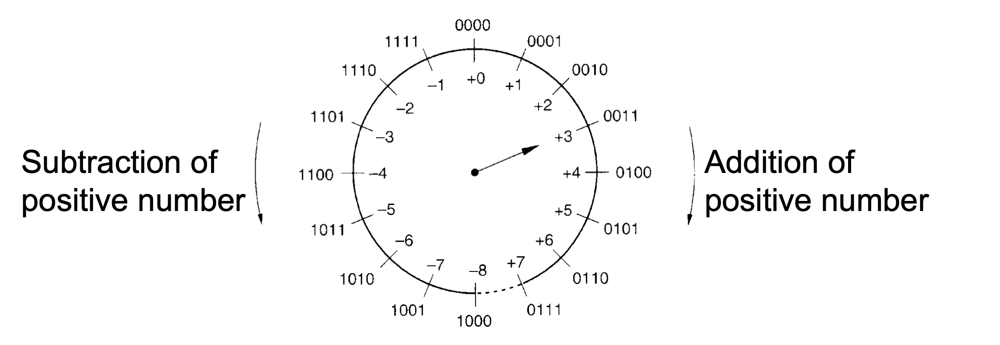
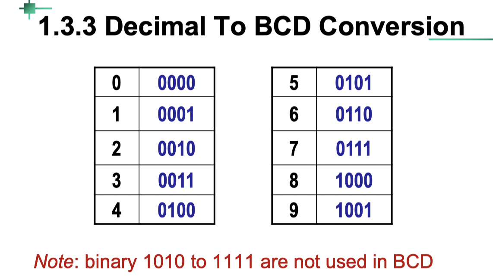
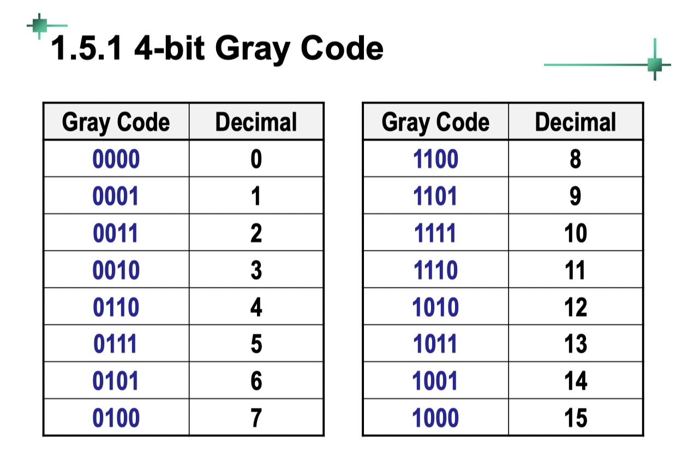

# Digital Circuit
### Part 1

感悟：电气 (Electrical) 利用电的能量 (Energy), 电子 (Electronic) 利用电的信息 (information)

- 浮点型十进制转化为n进制
整数部分除n倒排，小数部分乘n正排

- n进制转化为十进制
加权相加即可

### Part 2

二进制数的表示方式：第一位为符号位（0正1负）
对于正数 原码=反码=补码

- 正数 -> 负数
原码(Sign&Magnitude number)：符号位变化
反码(1s’ complement number)：取反
补码(2’s complement number)：取反 + 1

补码表示下加减法位数溢出部分直接忽略（只有固定位数是有效值）

- Overflow：只可能在同号相加时发生
- 注意区分overflow和自然舍弃的区别

#### range

- For n-bit binary, the range is:
  
  | Type           | Range                             |
  | -------------- | --------------------------------- |
  | Unsigned       | $0 \to +2^n - 1$                  |
  | 1’s Complement | $−(2^{n-1} − 1) \to +2^{n-1} − 1$ |
  | 2’s Complement | $−2^{n-1} \to +2^{n-1} − 1$       |
  

#### Different codes

1. **BCD (Binary-Coded Decimal) [8421 Code]**

   

2. **2421 Code 权重为2-4-2-1**

two numbers of 9 complement each other

3. **Excess-3 Code**

表面值 -3 即为实际值

two numbers of 9 complement each other

4. **Gray Code**

the adjacent numbers have only 1 bit different.

5. ASCII Code 

a 7-bit code

[Back to Outline](courses/EE202-17.md)
