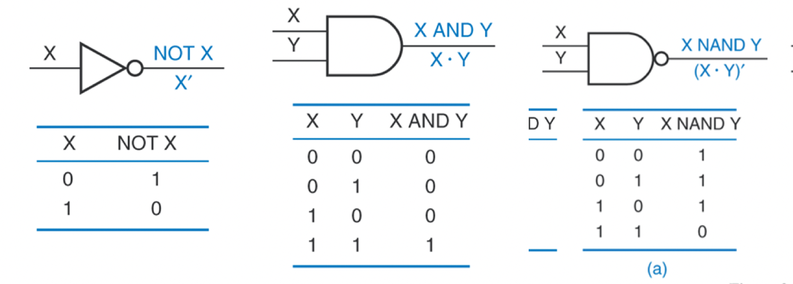
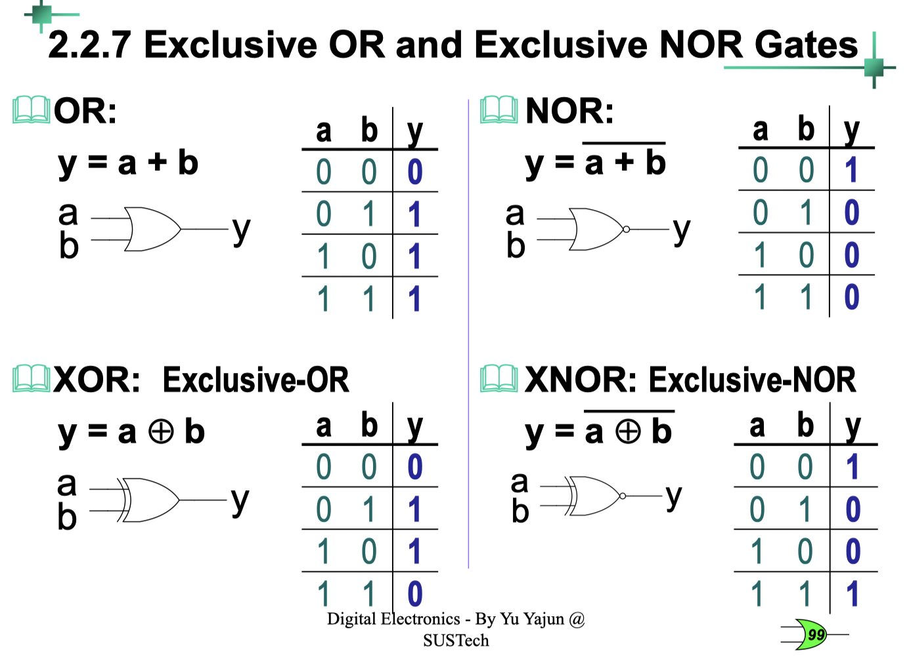
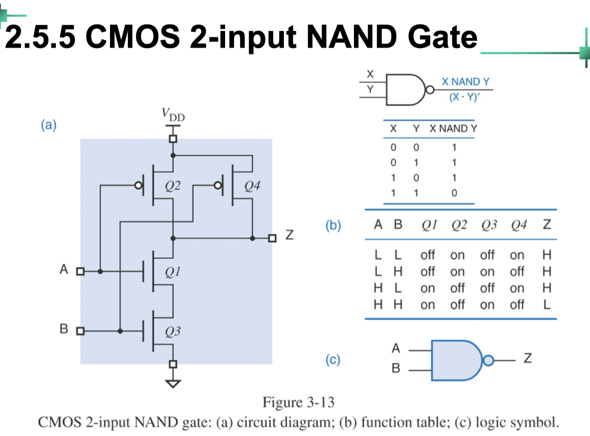
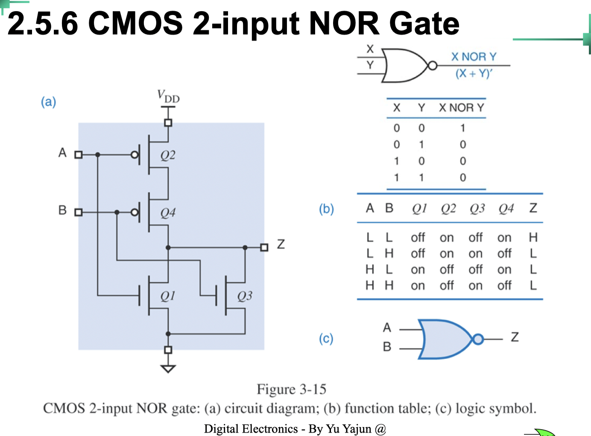

# Class 2 CMOS-Design

### common logic signs

### Fundamental Elements

- nMOS作驱动器(Pull-down), pMOS作负载器 (Pull-up)

  - PMOS适合传导高电平 (接近VDD), NMOS适合传导低电平(接近GND/VSS).

  - 如果NMOS传输高电平，随着输出电压的上升，Vgs越来越小，一方面电流驱动能力不够，一方面电平损失较大

- 忽略内部实现，关注连接（输出）本质
- $V_{DD}$和Ground实现了NOT，剩余电路实现了AND/OR

- AND p并n串
- OR  p串n并

#### Noise Margins

mos管是电压控制的原件，不需要额外电流，省电

#### Sink Current (灌电流) and Sourcing Current (拉电流)

#### FANOUT

fanout = min($\displaystyle{\frac{I_{OHmax}}{I_{IHmax}}}$, $\displaystyle{\frac{I_{OLmax}}{I_{ILmax}}}$)

#### Unused Inputs

CMOS inputs不应浮空

> 以下内容没有在quiz或考试中出现过

#### Rise and Fall times

$t_f \propto R_nC$ where $R_n$ is the “on” resistance of n−transistor. 

$t_r \propto R_pC$ where $R_p$ is the “on” resistance of p−transistor. 

#### Propagation Delay

The time between an input change and the corresponding output change

#### Power Consumption

$P_D = VI = V_{cc}\displaystyle{\frac{dQ}{dt}} = V_{cc}\displaystyle{\frac{C_L dV}{dt}} = C_L \cdot V^2_{CC} \cdot f$

$V_{CC}$: the power supply voltage.

𝑓 : The transition frequency of the output signal. 

$C_L$: Equivalent capacitive load both internally and externally on the output.

[Back to Outline](courses/EE202-17.md)
