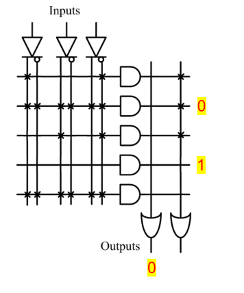

# CLASS 4 Combo Logic

### Propagation Delay

Two level delay: if one input is LOW, and the other is changed. 

Three level delay: if one input is HIGH, and the other is changed.

### Programmable Logic Devices

- A product term (P) is 1 if no inputs are connected (internal pull up for AND gate).
-  A product term (P) is 0 if all inputs are connected.
-  An output term (O) is 0 if no product term is connected

### Decoder, MUX & Comparator

- Decoder n inputs - 2^n outputs

- (Priority) Encoder 2^n inputs - n outputs

- MUX (e.g.) 2^n inputs - n select signals - 1 output

- DMUX 1 input - n select signals - 2^n output lines

- for each bit $S_i = A_i B_i + A_i' B_i'$

- Comparator中$I_{A=B}具有最高优先级$
- Comparator中$I$有效的前提是**Input Number**全部相等

- 默认情况下$I_{A=B}$应置1, 剩余置0

### Adder

- Subtraction using 2‘s complement

A - B = A + (-B) = A + (B' + 1)

- Carry-Look-Ahead Adder

$C_{i+1} = G_i + P_iC_i$

Carry Generate $G_i = A_iB_i$

Carry propagate $P_i = A_i\oplus B_i$

$S_i = A_i\oplus B_i\oplus C_i = P_i\oplus C_i$

$C_{i+1} = (A_i B_i + A_i C_i + B_i C_i) = G_i + P_i C_i $

[Back to Outline](courses/EE202-17.md)

