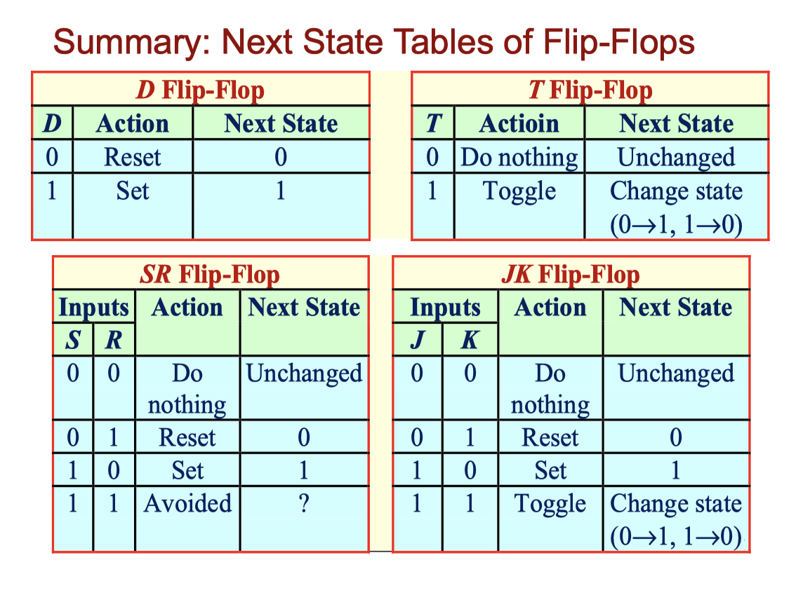

# CLASS 5 SeqLogic Principle 

### Latch

$SR\ Latch$ or $\bar{S}\bar{R}\ Latch$

- SR can not be asserted simultaneously

### Flip-Flop (Clocked Latch)

### State Machine

- Mealy Machine: $output = f(Q, input)$
- Moore Machine: $output = f(Q)$

#### Equation Definitions

- Characteristic Equation 

  $Q^{\ast} = f(Q, excitation\ signals)$

- Excitation Equation

  $Excitation\ signals = f(Q, input)$

- Transition Equation

  $Q^{\ast} = f(Q, input)$

- Transition Table -> State Table: xxxx -> S_x

#### State Machine Design (With Flip-Flop)

1. State Diagram
2. State/Output Table -> Transition/Excitation Table
3. Excitation Equation
4. State Machine

[Back to Outline](courses/EE202-17.md)
