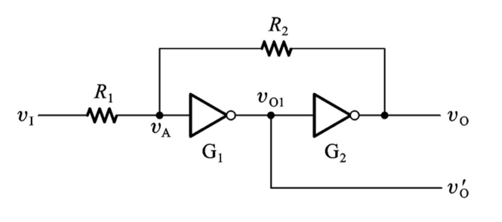
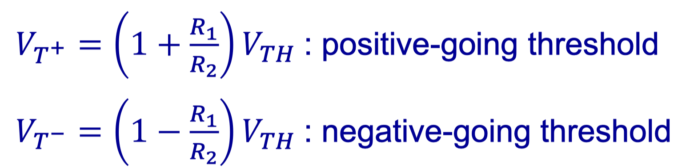
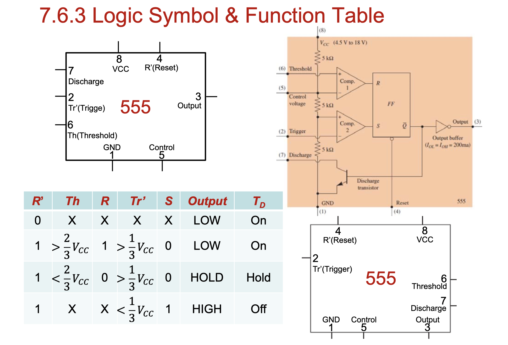
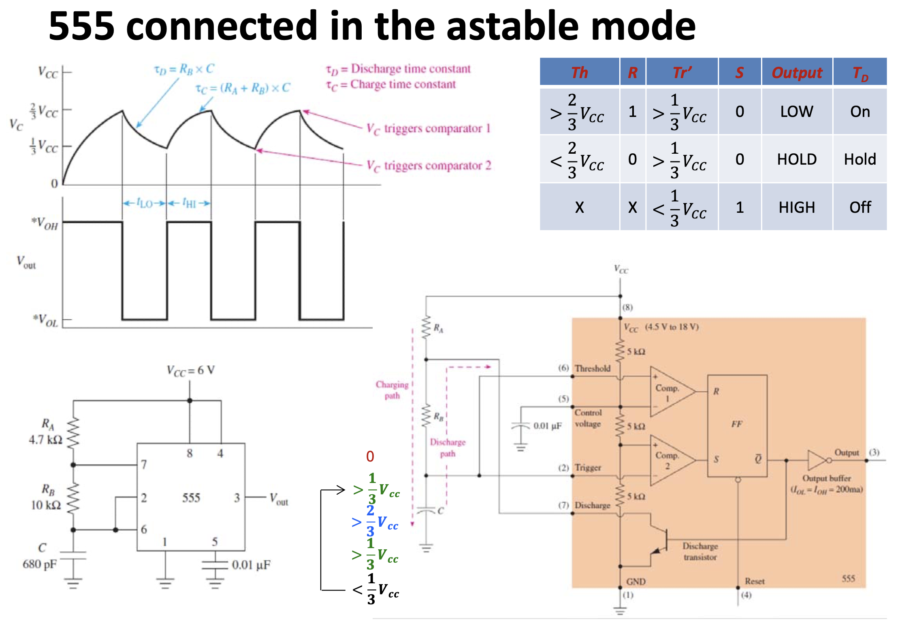
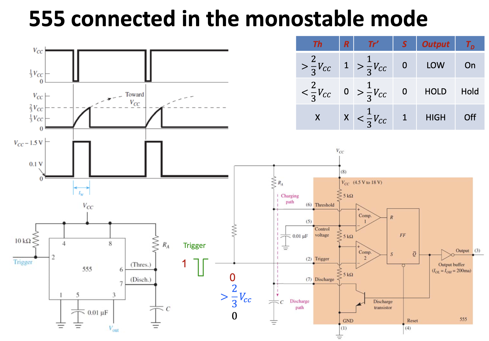

# CLASS 7 Multivibrator&555

[TOC]

### Schmitt Trigger

### Multivibrator

- RC Circuit

$v(t) - v_0 = (V-v_0)(1-e^{-t/RC})$

$t = RC \displaystyle \ln{(\frac{V-v_0}{V-v_t})}$

- Astable and Monostable MultiVibrator

- $t_w = R_{ext}C_{ext}\ln{2}$ (for MSI 74121)

### 555 IC Timer

- Astable and Monostable (with Trigger pulse) Mode

[Back to Outline](courses/EE202-17.md)
