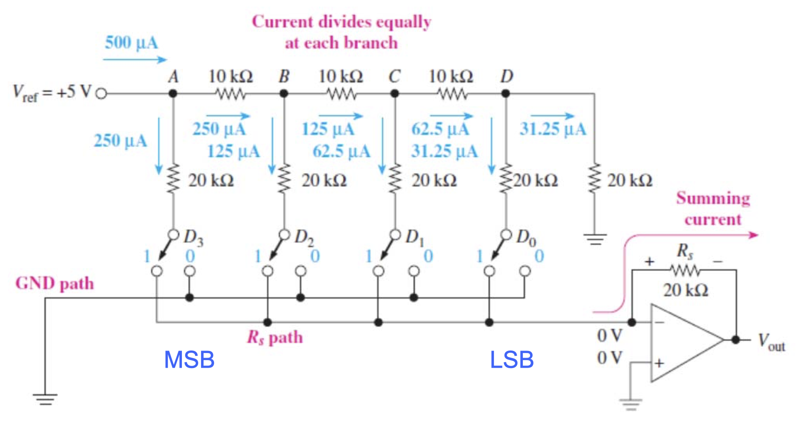

# CLASS 9 Digital-Analog-Converter

- **analog output = K \* digital input**, K is proportionality factor/resolution/step size
- **resolution = K =** $\displaystyle \frac{A_{fs}}{2^N-1}$, $A_{fs}$ is the analog full-scale output, N is the number of bits

### DAC Circuitry – R/2R Ladder DAC

[Back to Outline](courses/EE202-17.md)
