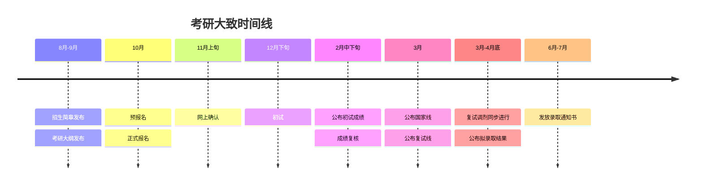

# 考研流程

## 时间线
考研大致时间线如下（注意这是一个很粗略的时间，请以各个高校发布的具体时间为准）

- 专业课查询：[研招网]->[硕士目录]，根据学校和专业进行初试专业课科目查询。
- 调剂在复试前后都可以报名

碎碎念

考研是纯粹选拔性的考试，是真正意义上的千军万马过独木桥，要么上岸，要么落水。而一旦落榜，你为之所做的一切努力就是白费的，你为考研所学的那几门课并没有什么用，考研过程中的经历也很难称之为有价值。经历无意义的时间并不可怕，为无意义的时间寻找理由宽慰自己才是一种自欺欺人。

说这些并不是表示考研不对，至少它为很多人提供了另一个机会，而是说你应当在做好足够的觉悟后再决定考研。硕士研究生是为有准备有目的者准备的，而不是为逃避现实的人准备的。

## 参考资料
- [硕士专业目录-研招网](https://yz.chsi.com.cn/zsml/)
