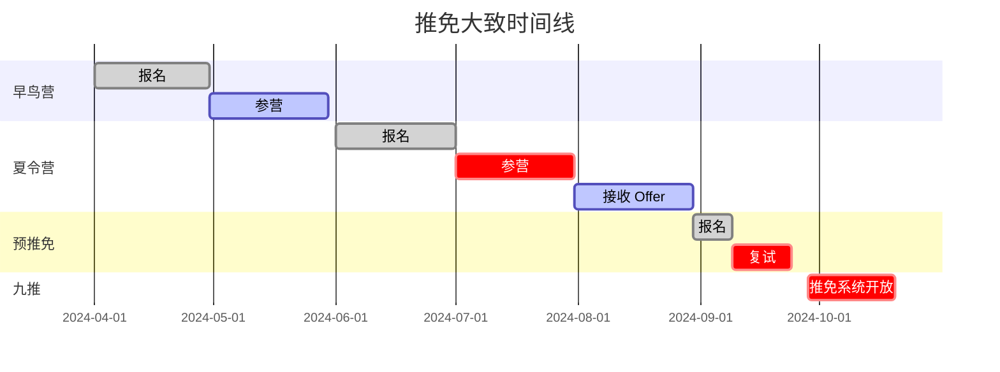

# 推免流程

## 时间线
推免大致时间线如下（注意这是一个很粗略的时间，请以各个高校发布的具体时间为准）

### 早鸟营
部分香港高校的直博招生、清华的求真书院、一些高校的经管类夏令营报名和参营时间都很早，如果其中有你的意向专业，可以提前留意并参加。

### 夏令营
高校招生的重点，一般在**六月报名**，**七月参营**。夏令营一般会包含参观、学员介绍、笔试 (optional)、面试等环节，长达 2-3 天。夏令营结束一段时间后高校会下发优秀营员。不同高校优营的效力不尽相同，有的等同于 Offer，有的只是后续预推免的加分项。

### 预推免
高校招收推免生的另一个重要途径，通常初审门槛低于夏令营，但可能名额较少。有的高校将预推免作为夏令营招生的补充，有的高校只开设预推免而不开设夏令营。

报名时间一般在**九月上旬**，复试设置在**九月中下旬**。预推免流程较短，不再安排参观等活动，直接进行笔试面试，在一天之内结束。

### 九推
9.28 推免系统正式开放后，由于部分高校的名额仍然没有招满（比如招生门槛过高导致被鸽穿），会在该阶段继续招生。九推的名额通常不固定，请仔细留意各高校的招生信息。

如果你已经在夏令营或预推免中获得 Offer，那么只需要在 9.28 接收高校的复试通知和预录取即可，无需参加九推。

## 参考资料
- [全国推荐免试攻读研究生（免初试、转段）信息公开管理服务系统](https://yz.chsi.com.cn/tm/)
