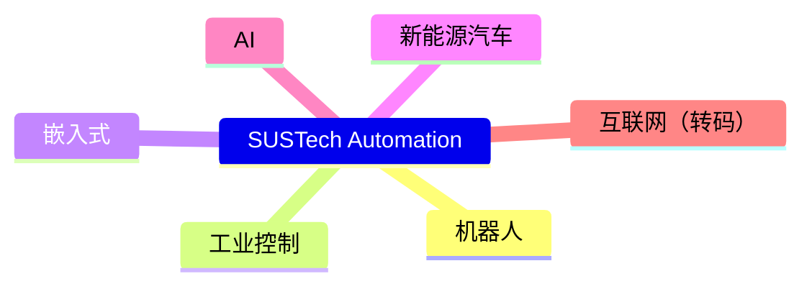

# Employment

## Internship

[Internship](employment/internship.md)

## Full-time
[Full-time](employment/full-time.md)

## Areas

不同学校的自动化专业培养方向差异极大，南科大的自动化完全没有机械相关课程。

课程设置（必修+选修）大致是控制理论、机器人、嵌入式、AI 这四个大块方向，其中会穿插一些 CS 的课程，所以就业也会向这四个方向倾斜。

- 就业领域示意图：

