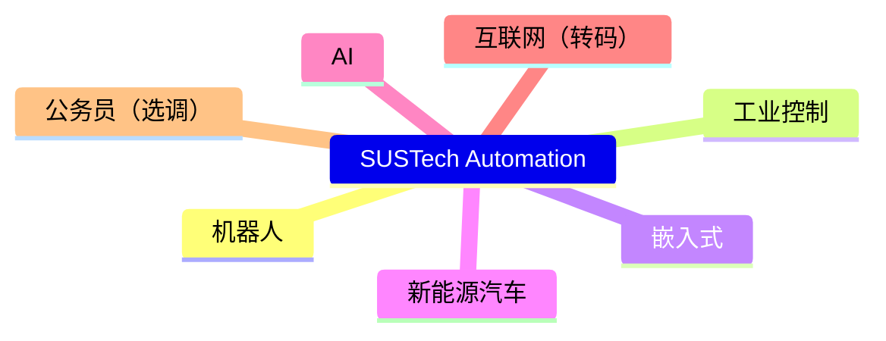

# Full Time Job

## 领域

- 就业领域示意图：

```mermaid
mindmap
  SUSTech Automation
    机器人
    工业控制
    嵌入式
    新能源汽车
    AI
    互联网（转码）
    公务员（选调）
```

#### 公务员
自动化在考公中是非常劣势的专业，一般情况下只能考三不限，所以：
- 建议保研至华五走选调
- 或者跨保到公务员岗位较多的专业

#### 跨领域
工业界、学术界、政治体系之间并没有不可逾越的高墙，但进行领域的跨越需要你在原有领域做出足够的成绩。

## 经验分享
TODO